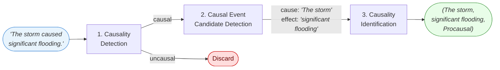

# Causality Extraction

Causality extraction is the **end-to-end** task of extracting structured causal relations from
natural language text. It is typically decomposed into three sequential subtasks
[@hagen:2025a]:



Sentences classified as `Uncausal` at step 1 are discarded.

### Output

A fully extracted relation is a triple:

| Field | Type | Description |
|-------|------|-------------|
| `cause` | `str` | The causing event span |
| `effect` | `str` | The caused event span |
| `relation` | `Relation` | `Procausal` or `Concausal` |

### Example

```
Input:  "The storm caused significant flooding."

Output: {
    cause:    "The storm",
    effect:   "significant flooding",
    relation: Relation.Procausal
}

Input:  "Sugar does not cause hyperactivity."

Output: {
    cause:    "Sugar",
    effect:   "hyperactivity",
    relation: Relation.Concausal
}
```

A single sentence may yield multiple relation triples when several cause–effect pairs are present.

## Subtasks

| Step | Task | Page |
|------|------|------|
| 1 | Sentence-level classification | [Causality Detection](causality_detection.md) |
| 2 | Span extraction | [Causal Event Candidate Detection](causal_event_candidate_detection.md) |
| 3 | Relation classification | [Causality Identification](causality_identification.md) |

## Datasets

| Corpus | Sentences | Domain | Year | Reference | Links |
|--------|-----------|--------|------|-----------|-------|
| AltLex | 1,000 | Wikipedia | 2016 | [@hidey:2016] | [:hugging:](https://huggingface.co/datasets/thagen/AltLex) |
| BECauSE 2.0 | 1,803 | News | 2017 | [@dunietz:2017] | [:hugging:](https://huggingface.co/datasets/thagen/BECauSEv2) |
| BioCause | 851 | Medical | 2013 | [@mihaila:2013] | |
| CaTeRs | 488 | Fiction | 2016 | [@mostafazadeh:2016] | |
| Causal News Corpus (CNC) | 1,957 | News | 2022 | [@tan:2022a] | [:hugging:](https://huggingface.co/datasets/thagen/CausalNewsCorpus) |
| CausalTimeBank (CTB) | 2,201 | News | 2014 | [@mirza:2014a] | [:hugging:](https://huggingface.co/datasets/thagen/CausalTimeBank) |
| Countercausal News Corpus (CCNC) | 3,415 | News | 2025 | [@hagen:2025counterclaims] | |
| EventStoryLine (ESL) | 2,247 | News | 2017 | [@caselli:2017] | [:hugging:](https://huggingface.co/datasets/thagen/EventStoryLine) |
| FinCausal | 2,136 | Finance | 2020 | [@mariko:2020] | |
| PDTB 3.0 | — | News/WSJ | 2019 | [@webber:2019] | [:hugging:](https://huggingface.co/datasets/thagen/PennDiscourseTreebankv3) |
| PolitiCause | 5,070 | Politics | 2024 | — | |
| SCITE | 5,236 | Science | 2021 | [@li:2021] | [:hugging:](https://huggingface.co/datasets/thagen/SCITE) |
| SemEval 2010 Task 8 | 10,690 | General | 2010 | [@hendrickx:2010] | [:hugging:](https://huggingface.co/datasets/thagen/SemEval2010T8) |
| UniCausal | 14,903 | Multiple | 2023 | [@tan:2023] | |

## Models

End-to-end causality extraction results are typically reported per subtask. See the individual task
pages for model benchmarks.
